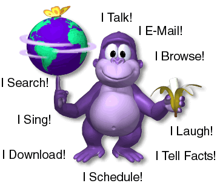

# BonziBUDDY for Linux, macOS, and Windows

<p align="center">
  
</p>

> Take a minute and make a friend for life.

BonziBUDDY is a native Python and Qt port of the purple-gorilla desktop pet.
It brings Bonzi back as a draggable, always-on-top companion for Linux, macOS,
and Windows, without Wine or the .NET Framework.

## Why This Exists

This port was made to preserve and inspect a piece of desktop-software history:

- The original application is frequently flagged as malware, so an open-source
  implementation makes its behavior reviewable.
- The original depended on the .NET Framework 2.0 and Windows-era tooling.
- A native implementation makes the desktop pet usable on Linux and other
  modern platforms.
- The source is available for anyone to audit, improve, or learn from.

<p align="center">
  
</p>

## What It Does

- Shows Bonzi as an animated desktop companion with a right-click menu.
- Speaks with an optional local text-to-speech engine, tells jokes and facts,
  and sings songs.
- Reads bundled stories and supports extra book content.
- Includes a calendar, reminders, web search shortcuts, and a download manager.
- Supports additional Microsoft Agent `.acs` character files.
- Runs as open source software so the implementation and network behavior can
  be inspected.

## Download

Standalone archives for Linux, Windows, and macOS are published on the
[Releases](https://github.com/kcoulsy/bonzi-buddy/releases) page. Extract the
archive for your platform and run the included `bonzi` binary.

## Run From Source

Requires Python 3.11 or newer.

```bash
./run.sh
```

On Linux, the launcher uses XWayland by default so Bonzi can be positioned and
dragged correctly on both X11 and Wayland desktop sessions. Set
`QT_QPA_PLATFORM` before launching to select a different Qt backend.

## Voice (Optional)

Install a local text-to-speech engine to let Bonzi talk. Without one, speech
still appears in the balloon.

```bash
sudo pacman -S espeak-ng
# Alternatives: festival or speech-dispatcher (spd-say)
```

## Project Status

This is a fan-made preservation and learning project, not affiliated with or
endorsed by BONZI.COM or Microsoft. The original branding and character assets
belong to their respective owners.

The retro promotional site is available at
[kcoulsy.github.io/bonzi-buddy](https://kcoulsy.github.io/bonzi-buddy/).
